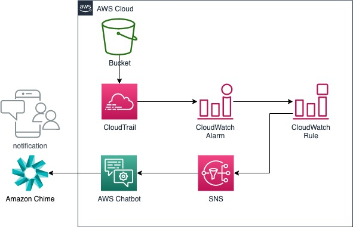
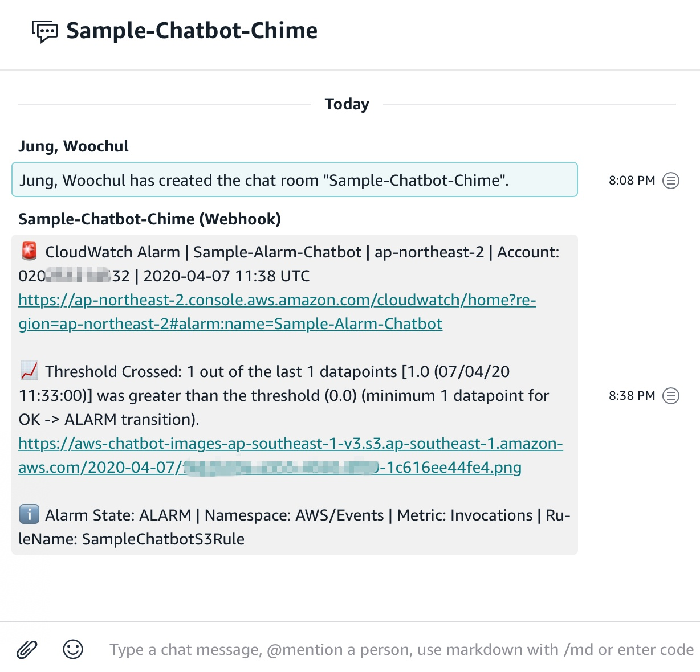
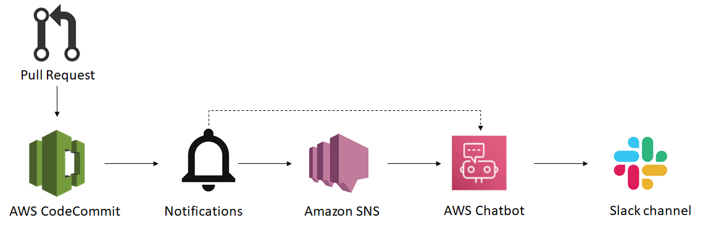

# AWS Chatbot

AWS Chatbot은 Slack 채널 및 Amazon Chime 채팅방을 통해 AWS 리소스를 쉽게 모니터링하고 상호 작용하도록 지원하는 대화형 에이전트입니다. AWS Chatbot을 활용하면 알림을 수신하고 명령을 통해 진단 정보를 반환하고, AWS Lambda 함수를 호출하고 AWS 지원 케이스를 생성하여 팀이 더 빠르게 협업하고 이벤트에 대응할 수 있습니다.
- [AWS Chatbot](https://aws.amazon.com/ko/chatbot/)

---

## S3 API에 대한 모니터링
- S3 특정 버킷에 작업이 있는 경우 해당 내용을 AWS Chatbot 을 이용하여 내용을 전달할 수 있습니다.
- Architecture


### 사용서비스
- AWS Chatbot
- AWS CloudTrail
- Amazon S3
- Amazon CloudWatch
- Amazon SNS
- Amazon Chime / Slack

### SNS
1. Create Topic
   1. Name
   2. Create topic 선택 버튼

### AWS Chatbot
1. Configuare new webhook
   1. Name
   2. Webhook URL
      1. 채팅룸/Slack 채널 생성
      2. Chime : [채팅룸에 Webhook 추가](https://docs.aws.amazon.com/ko_kr/chime/latest/ug/webhooks.html)
      3. Slack
         1. Slack에서 Permission 설정
         2. Channel type : public
         3. channel 선택
   3. Permissions 설정
      1. IAM Role
      2. Policy template
   4. SNS Topic 선택
   
### CloudTrail
Amazon S3은 Amazon S3에서 사용자, 역할 또는 AWS 서비스가 수행한 작업의 레코드를 제공하는 서비스인 AWS CloudTrail과 통합됩니다. CloudTrail은 Amazon S3 콘솔의 호출 및 Amazon S3 API에 대한 코드 호출의 호출을 포함하여 Amazon S3에 대한 API 호출의 하위 세트를 이벤트로 캡처합니다. 추적을 생성하면 CloudTrail 이벤트를 비롯하여 Amazon S3 이벤트를 Amazon S3 버킷으로 지속적으로 배포할 수 있습니다.
- [AWS CloudTrail을 사용하여 Amazon S3 API 호출 로깅](https://docs.aws.amazon.com/ko_kr/AmazonS3/latest/dev/cloudtrail-logging.html)
1. Create trail
   1. Trail name 
   2. Data event : S3
   3. Add S3 bucket : **테스트를 위한 특정 버킷, Read, Write 선택**
   4. Storage location
      1. Create a new S3 bucket : No
      2. S3 bucket : 로그를 기록할 버킷 선택

### CloudWatch
1. Event Rules
   1. Event Pattern
      1. Service Name : Simple Storage Service(S3)
      2. Event Type : Object Level Operations
      3. Any Operation
      4. Specific bucket(s)  by Name : **테스트를 위한 특정 버킷 선택**

2. Alarm
   1. Step 1 : Specify metric and conditions
      1. Create alarm > select metric
      2. Events > By Rule Name : **생성한 Event Rule - Invocations 선택**
      3. Conditions
         1. Threshold : static
         2. Whenever Invocations is... : Greater
         3. than... : **0** 
         > 실행시마다 호출하기 위해 0으로 설정
   2. Step 2 : Confifure actions
      1. Send a norification to... : **SNS topic 선택**
   3. Step 3 : Add name and description
      1. Alarm name
   4. Step 4 : Preview and create 

### Test
1. S3
   1. Console > S3 > **특정 버킷**
   2. Upload file

2. Chime / Slack
   

3. Slack
   ```
   @aws lambda list-functions --region ap-northeast-2
   ```
   ```
   @woochul I ran the read-only command in account 020xxxxxxxxx:
   @aws lambda list-functions --region ap-northeast-2
   Functions (2):
   -
   FunctionName: amplify-sampleamplify-dev
   FunctionArn: arn:aws:lambda:ap-northeast-2:020251214532:function:amplify-sampleamplify-dev
   Runtime: nodejs10.x
   Role: arn:aws:iam::020xxxxxxxxx:role/upClientLambdaRole-dev
   Handler: index.handler
   CodeSize: 2451
   Timeout: 300
   MemorySize: 128
   Show less
   ```
---

## Code Pipeline 과 연동
개발자들은 가끔 Slack을 사용하여 코드에 대해 서로 이야기를 합니다. AWS Chatbot을 사용하면 저장소, 빌드 프로젝트, 배포 애플리케이션 및 파이프 라인과 같은 개발자 도구 리소스에 대한 알림을 구성하여 Slack 채널의 사용자에게 중요한 이벤트에 대해 자동으로 알릴 수 있습니다. 배포가 실패하거나 빌드가 성공하거나 풀 요청이 생성되면 개발자들이 작업 해야하는 알림을 받습니다.

현재 알림을 지원하는 AWS 서비스는 다음과 같습니다.

- AWS CodeCommit
- AWS CodeBuild
- AWS CodeDeploy
- AWS CodePipeline

### 솔루션 개요
알림 규칙을 생성하여 필요한 이벤트를 수신하고 동일한 웹 페이지에서 알림에 사용되는 Amazon SNS 주제를 생성 할 수 있습니다. 그런 다음 해당 Amazon SNS 주제로 전송 된 알림이 슬랙 채널에 나타나도록 AWS Chatbot을 구성 할 수 있습니다.

알림을 설정하려면 다음 다이어그램에 표시된대로 다음 프로세스를 수행하십시오.

1. 저장소에 대한 알림 규칙을 작성하십시오. 여기에는 알림에 사용할 Amazon SNS 주제 생성이 포함됩니다.
2. 해당 Amazon SNS 주제에서 슬랙 채널로 알림을 보내도록 AWS Chatbot을 구성하십시오.
3. 테스트하고 팀의 슬랙 채널에서 알림을 받는 것을 확인하세요.



### 참고자료
   - [Receive AWS Developer Tools Notifications over Slack using AWS Chatbot](https://aws.amazon.com/ko/blogs/devops/receive-aws-developer-tools-notifications-over-slack-using-aws-chatbot/)
   - [AWS CodeCommit 명령줄 레퍼런스](https://docs.aws.amazon.com/ko_kr/codecommit/latest/userguide/cmd-ref.html)